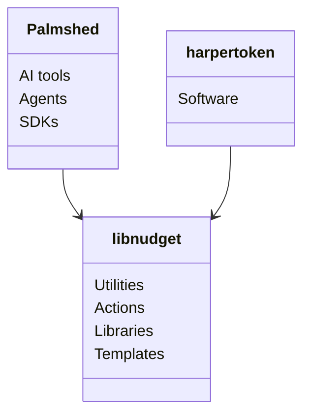

# libnudget

**small tools, plainly made**

[libnudget.github.io](https://libnudget.github.io)

[Palmshed](https://github.com/palmshed) · [harpertoken](https://github.com/harpertoken) · [libnudget](https://github.com/libnudget)

## Projects

### Released

| Tool                                                          | Latest                                                                                                                                                   | Use it                                                                     |
| ------------------------------------------------------------- | -------------------------------------------------------------------------------------------------------------------------------------------------------- | -------------------------------------------------------------------------- |
| [clipb](https://github.com/libnudget/clipb)                   |                             | `cargo install --git https://github.com/libnudget/clipb`                   |
| [craft](https://github.com/libnudget/craft)                   |                             | `cargo install --git https://github.com/libnudget/craft`                   |
| [mini](https://github.com/libnudget/mini)                     |                                | `go get github.com/libnudget/mini@latest`                                  |
| [startkit](https://github.com/libnudget/startkit)             |                    | `npx --yes github:libnudget/startkit mylib`                                |
| [dotenv-keep](https://github.com/libnudget/dotenv-keep)       |           | `pip install git+https://github.com/libnudget/dotenv-keep`                 |
| [release-notes](https://github.com/libnudget/release-notes)   |     | `uses: libnudget/release-notes@main`                                       |
| [gh-tag](https://github.com/libnudget/gh-tag)                 |                          | `uses: libnudget/gh-tag@main`                                              |
| [fmtcheck](https://github.com/libnudget/fmtcheck)             |                    | `uses: libnudget/fmtcheck@main`                                            |
| [bump](https://github.com/libnudget/bump)                     |                                | `uses: libnudget/bump@main`                                                |
| [echo](https://github.com/libnudget/echo)                     |                                | `uses: libnudget/echo@main`                                                |
| [gon](https://github.com/libnudget/gon)                       |                                   | `uses: libnudget/gon/.github/workflows/gon.yml@main`                       |
| [nightly](https://github.com/libnudget/nightly)               |                       | `uses: libnudget/nightly/.github/workflows/nightly.yml@main`               |
| [release-assets](https://github.com/libnudget/release-assets) |  | `uses: libnudget/release-assets/.github/workflows/release-assets.yml@main` |
| [rust-nightly](https://github.com/libnudget/rust-nightly)     |        | `uses: libnudget/rust-nightly/.github/workflows/nightly.yml@main`          |
| [activity](https://github.com/libnudget/activity)             |                    | `uses: libnudget/activity/.github/workflows/tracking.yml@main`             |
| [release](https://github.com/libnudget/release)               |                       | `uses: libnudget/release@v1.0.0`                                           |
| [auto-label](https://github.com/libnudget/auto-label)         |              | `uses: libnudget/auto-label@v2`                                            |
| [auto-merge](https://github.com/libnudget/auto-merge)         |              | `uses: libnudget/auto-merge@v1`                                            |
| [bot](https://github.com/libnudget/bot)                       |                                   | `uses: libnudget/bot/actions/commit@v1`                                    |
| [cancel](https://github.com/libnudget/cancel)                 |                          | `uses: libnudget/cancel@v1`                                                |
| [lock](https://github.com/libnudget/lock)                     |                                | `uses: libnudget/lock@v1`                                                  |
| [prune](https://github.com/libnudget/prune)                   |                             | `uses: libnudget/prune@v1`                                                 |
| [rust-fix](https://github.com/libnudget/rust-fix)             |                    | `uses: libnudget/rust-fix@v1`                                              |
| [stale](https://github.com/libnudget/stale)                   |                             | `uses: libnudget/stale@v1`                                                 |
| [title](https://github.com/libnudget/title)                   |                             | `uses: libnudget/title@v1`                                                 |
