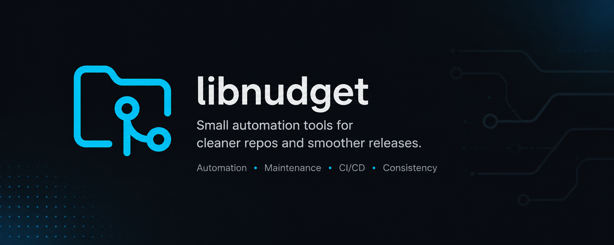

**🛠️ small tools that do one thing well 🧰**  
🔗 pin one · 🔍 read one · 🚀 run one · ⏳ leave one behind  
_quiet software, built to last_

# libnudget

We make small tools that solve one problem well.

Most projects start by promising a lot. We started the other way around,
from the small things. A clipboard utility. A tagger. A nightly build.
Nothing that needs a bow on it, only work that can be trusted to hold.

There is a strand running through all of it: keep the tool small enough to
read, honest enough to keep, and easy enough to replace. Not because small
is pretty. Because small is what lasts.

## The collection

Some are developer tools you run on your own machine. Others are GitHub
Actions that quietly look after a repository overnight. A few are
still finding their shape.

### Released

| Tool | Latest | Use it |
| --- | --- | --- |
| [clipb](https://github.com/libnudget/clipb) |  | `cargo install --git https://github.com/libnudget/clipb` |
| [craft](https://github.com/libnudget/craft) |  | `cargo install --git https://github.com/libnudget/craft` |
| [mini](https://github.com/libnudget/mini) |  | `go get github.com/libnudget/mini@latest` |
| [startkit](https://github.com/libnudget/startkit) |  | `npx --yes github:libnudget/startkit mylib` |
| [dotenv-keep](https://github.com/libnudget/dotenv-keep) |  | `pip install git+https://github.com/libnudget/dotenv-keep` |
| [release-notes](https://github.com/libnudget/release-notes) |  | `uses: libnudget/release-notes@main` |
| [gh-tag](https://github.com/libnudget/gh-tag) |  | `uses: libnudget/gh-tag@main` |
| [fmtcheck](https://github.com/libnudget/fmtcheck) |  | `uses: libnudget/fmtcheck@main` |

### The rest

- release, bump, gh-tag, release-notes, fmtcheck, rust-fix, auto-merge,
  auto-label, title, cancel, lock, prune, stale, echo: the automations
  that keep a repository honest while no one is watching.
- nightly, rust-nightly, release-assets, activity, gon, bot: reusable
  workflows and a bit of quiet machinery.

Every project is open source. The full list, with current releases, lives
on [libnudget.github.io](https://libnudget.github.io).

## Who we are

libnudget is a company of [Palmshed](https://github.com/palmshed), which
builds open-source AI tools, agents, and SDKs. Palmshed builds the big,
ambitious things. libnudget keeps the small ones neat.
The same quiet way of working runs through both: build carefully, ship
honestly, stay easy to leave behind.

## Small is how we say what we mean

We would rather build one thing really well than fifty things halfway.
The work should match what the README promises, be plain to follow, and
never trap you in. Whether a project is a first sketch or here to stay,
it gets the same care.

And if one puzzles you, or breaks on you, tell us. We stay useful only
by staying willing to be corrected.